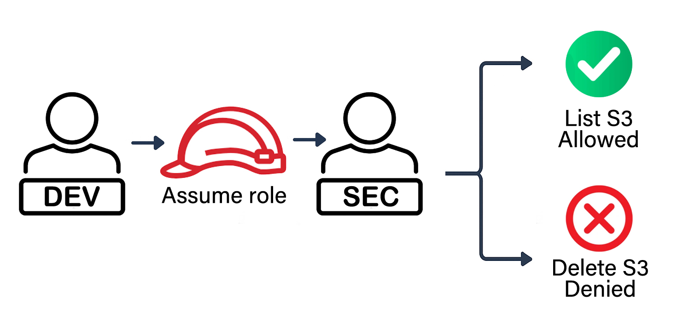

# AWS CSS – Domain 4 – Cross-Account Access with IAM Roles & SCPs  

Built and secured cross-account access in AWS using **IAM Roles** and **Service Control Policies (SCPs)** to demonstrate a **controlled IAM model**.  

**Why it matters:** Multi-account AWS environments are common in enterprises. Enabling secure cross-account access is critical for productivity, but it must be balanced with **guardrails** to prevent misuse. This lab shows how to implement **least privilege + org-wide enforcement**.  

---

## Table of Contents

- [Overview](#overview)  
- [Objectives](#objectives)  
- [Diagram](#diagram)  
- [Steps Performed](#steps-performed)  
  - [1. AWS Accounts & OUs Setup]  
  - [2. Security Account Role Creation]  
  - [3. Dev Account Policy & User Setup]  
  - [4. Service Control Policies (SCPs)]  
  - [5. Testing & Proof]  
  - [6. Cleanup]  
- [Screenshots](#screenshots)  
- [Lessons Learned](#lessons-learned)  
- [References](#references)   
- [Contact](#contact)  

---

## Overview

This lab implements **secure cross-account access**:  

- Developers in the **Dev Account** assume a role in the **Security Account**.  
- Access is restricted to **read-only** actions with **IAM Role policies**.  
- **Service Control Policies (SCPs)** enforce org-wide guardrails to block destructive actions.  
- Both **allowed** and **denied** actions were tested and verified.  

---

## Objectives

- Configure IAM role trust between **Dev → Security accounts**.  
- Enforce use of **External ID** to prevent confused deputy problem.  
- Attach **ReadOnlyAccess** policy to the cross-account role.  
- Apply **SCPs** at the org level to deny destructive actions.  
- Prove enforcement with **AWS CLI tests** (allowed vs. blocked).  

---

## Diagram

Flow: Dev User → AssumeRole → Security Account Role → Allowed Actions (List S3) / Blocked Actions (Delete S3)  

  

---

## Steps Performed

### 1. AWS Accounts & OUs Setup
   - Created **Dev** and **Security** accounts under OUs *(Screenshot: `accounts-in-correct-ous.png`)*  
   - Verified account separation inside AWS Organizations.  

### 2. Security Account Role Creation
   - Created IAM role `SecurityCrossAccountRole` *(Screenshots: `security-account-dashboard.png`, `role-trust-setup.png` & `role-created.png`)*  
   - Trusted Dev Account (`540751377690`) with **External ID** *(Screenshot: `trust-json.png`)*  
   - Attached **ReadOnlyAccess** policy.  

### 3. Dev Account Policy & User Setup
   - Created custom IAM policy to allow `sts:AssumeRole` *(Screenshot: `dev-policy-created.png`)*  
   - Attached policy to `dev-user` *(Screenshot: `dev-user-with-policy.png`)*  
   - Verified `dev-user` setup in Dev Account *(Screenshot: `dev-dashboard.png`)*  

### 4. Service Control Policies (SCPs)
   - Enabled SCPs in AWS Organizations *(Screenshot: `scp-enabled.png`)*  
   - Created **DenyDangerousActions** SCP *(Screenshot: `scp-json.png`)*  
   - Attached SCP to **Security OU** *(Screenshot: `scp-attached.png`)*  

### 5. Testing & Proof
   - Assumed role from Dev → Security via CLI *(Screenshot: `role-assumption-success-cli.png`)*  
   - Verified **allowed action**: `aws s3 ls` lists Security Account bucket *(Screenshot: `allowed-action.png`)*  
   - Verified **blocked action**: bucket deletion denied by SCP *(Screenshot: `blocked-action.png`)*  

### 6. Cleanup
   - Removed S3 test bucket.  
   - Detached and deleted SCP.  
   - Deleted IAM role in Security Account.  
   - Deleted IAM policy + user in Dev Account.  
   - Left empty accounts in AWS Organization (or optionally close them if root access is set).  

---

## Screenshots

*All screenshots are included in the `screenshots/` folder.*  

| Step | Filename                        | Description                                        |
| ---- | ------------------------------- | -------------------------------------------------- |
| 1    | accounts-in-correct-ous.png     | Dev & Security accounts placed in correct OUs      |
| 2    | security-account-dashboard.png  | Security Account console dashboard                 |
| 2    | role-trust-setup.png            | Role trust setup screen (Dev ID + External ID)     |
| 2    | role-created.png                 | IAM role created in Security Account               |
| 2    | trust-json.png                  | Trust relationship JSON with Dev + External ID     |
| 3    | dev-dashboard.png               | Dev Account console dashboard                      |
| 3    | dev-policy-created.png          | Custom AssumeRole policy JSON in Dev Account       |
| 3    | dev-user-with-policy.png        | Dev user with attached AssumeRole policy           |
| 4    | scp-enabled.png                 | SCPs enabled in AWS Organizations                  |
| 4    | scp-json.png                    | SCP JSON denying DeleteUser + DeleteBucket         |
| 4    | scp-attached.png                | SCP attached to Security OU                        |
| 5    | role-assumption-success-cli.png | CLI session assuming SecurityCrossAccountRole      |
| 5    | allowed-action.png              | Allowed action: S3 bucket listed successfully      |
| 5    | blocked-action.png              | Blocked action: S3 bucket deletion denied          |

---

## Lessons Learned

- **Cross-account IAM roles** are powerful but must use **External IDs** for security.  
- **SCPs provide guardrails** that even admins in the target account can’t bypass.  
- Testing **both allowed and denied actions** is essential to prove policies work.  
- In multi-account setups, **least privilege + org-level controls** = stronger security posture.  

---

## References

- [IAM Roles](https://docs.aws.amazon.com/IAM/latest/UserGuide/id_roles.html)  
- [STS AssumeRole](https://docs.aws.amazon.com/STS/latest/APIReference/API_AssumeRole.html)  
- [Service Control Policies](https://docs.aws.amazon.com/organizations/latest/userguide/orgs_manage_policies_scps.html)  
- [AWS CLI](https://docs.aws.amazon.com/cli/latest/userguide/cli-chap-welcome.html)  

---

## Contact

Sebastian Silva C. – September 2025 – Berlin, Germany.  
- [LinkedIn](https://www.linkedin.com/in/sebastiansilc/)  
- [GitHub](https://github.com/AWS-CSS-Portfolio)  
- [sebastian@playbookvisualarts.com](mailto:sebastian@playbookvisualarts.com)  
